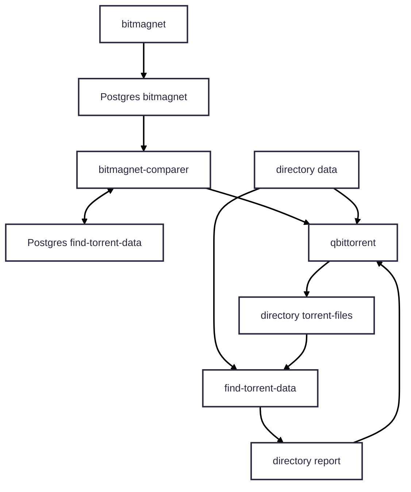

# Схема

```mermaid
---
config:
      theme: redux
---
flowchart TD
        pg-bm[Postgres bitmagnet]
        pg-ftd[Postgres find-torrent-data]
        qb[qbittorrent]
        ftd[find-torrent-data]
        bc[bitmagnet-comparer]
        bitmagnet[bitmagnet]
        
        dtf[directory torrent-files]
        dd[directory data]
        dr[directory report]
        
        bitmagnet --> pg-bm


        pg-bm --> bc

        bc <--> pg-ftd
        bc --> qb

        qb --> dtf
        dd --> ftd
        dtf --> ftd
        ftd --> dr

        dr --> qb
        dd --> qb
```
